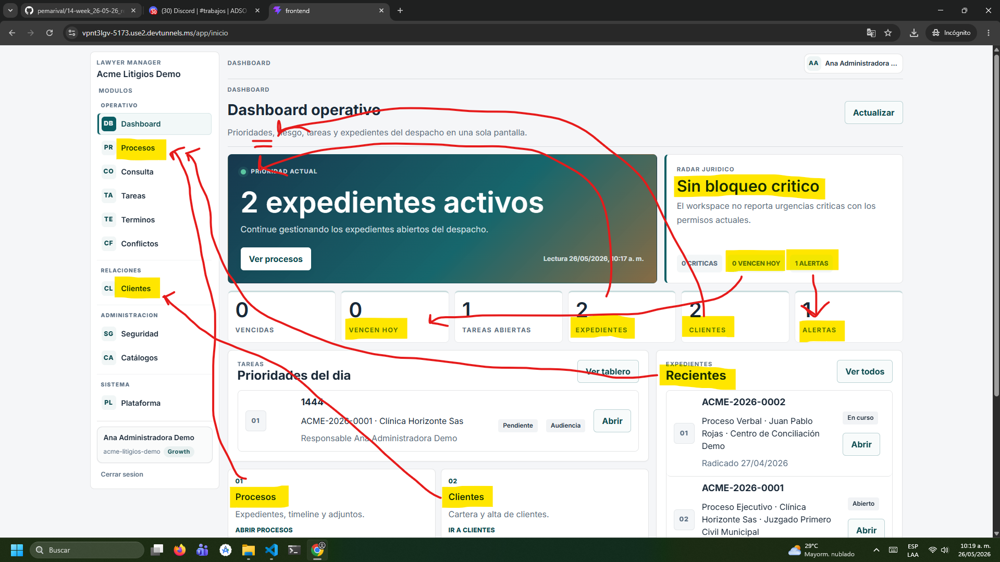
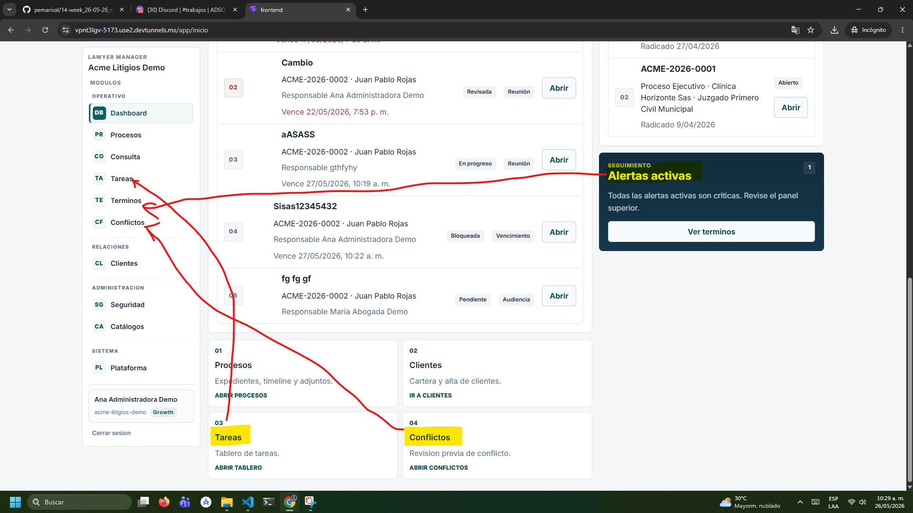
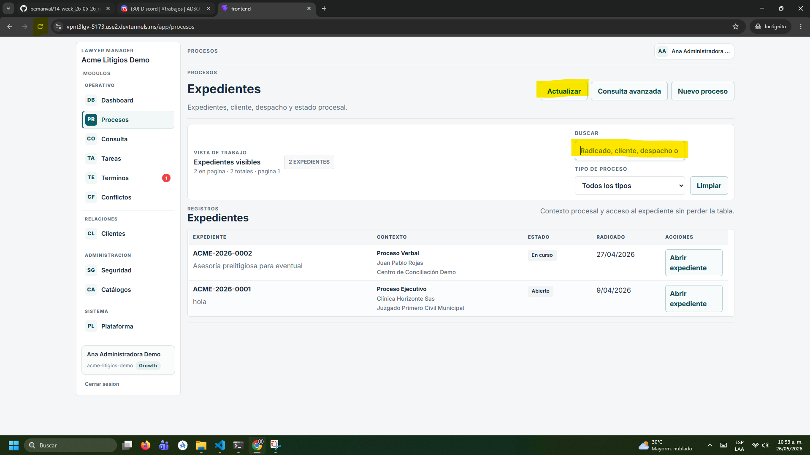
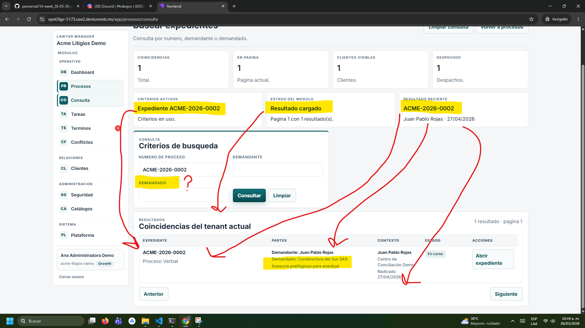

En el apartado de dashboard se puede ver mucha redundancia. Los únicos apartados que ve necesarios para un resumen de todos los datos, es el de la cantidad de expedientes, alertas criticas, cantidad de tareas abiertas y cantidad de tareas vencidas.

Además el botón que dice ctualizar se encarga de hacer lo mismo, que el actualizar en el navagador web.

En la parte de procesos no me permite ver bien todo lo que puedo buscar con claridad.

Al realizar una consulta avanzada, hay duplicidad en criterios activos, estado del modulo y resultado reciente. Además, en los expendientes no se sabe quien es el demandado, por lo que es difícil buscarlo de esa forma. A no ser que a la persona que realiza la consulta le den el nombre. Porque de manera directa no sale.

